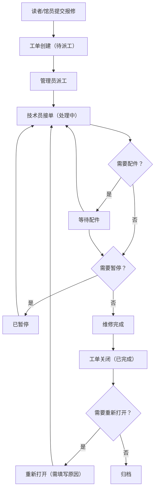

## 1. 产品概述

图书馆设备报修看板系统，用于管理自助借还机、门禁、公共电脑等图书馆资产的报修登记和维修跟进流程。系统支持多角色协作、完整状态流转、灵活筛选和数据导出，确保设备故障得到及时处理。

## 2. 核心功能

### 2.1 用户角色

| 角色 | 描述 | 核心权限 |
|------|------|----------|
| 读者/馆员 | 报修提交人 | 提交报修工单、查看自己提交的工单 |
| 技术员 | 维修处理人员 | 查看分配给自己的工单、更新处理进度、修改状态 |
| 管理员 | 系统管理者 | 所有权限、配置优先级、管理资产、导出历史记录、修改系统配置 |

### 2.2 功能模块

1. **看板首页**：工单看板视图、统计概览、快速筛选
2. **工单列表**：按资产/区域/优先级/处理人筛选、搜索、排序
3. **工单详情**：完整信息展示、时间线、状态操作
4. **提交报修**：报修表单、资产选择、问题描述
5. **系统配置**：优先级配置、资产分组管理、用户管理
6. **导出中心**：维修记录导出、历史数据查询

### 2.3 页面详情

| 页面名称 | 模块名称 | 功能描述 |
|-----------|-------------|---------------------|
| 看板首页 | 统计卡片 | 显示各状态工单数量、今日新增、待处理数 |
| 看板首页 | 看板列 | 按状态分列展示工单卡片，支持拖拽 |
| 看板首页 | 筛选栏 | 按资产类型、区域、优先级、处理人快速筛选 |
| 工单列表 | 筛选器 | 多条件组合筛选、搜索、排序 |
| 工单列表 | 数据表格 | 展示工单列表、支持分页、批量操作 |
| 工单详情 | 工单信息 | 资产信息、报修人、时间、优先级、处理人 |
| 工单详情 | 时间线 | 完整操作历史记录时间线 |
| 工单详情 | 操作区 | 派工、更新进度、修改状态、添加备注 |
| 提交报修 | 报修表单 | 资产选择、位置、问题描述、照片上传 |
| 系统配置 | 优先级配置 | 配置优先级名称、颜色、排序 |
| 系统配置 | 资产分组 | 管理资产类型、区域、资产清单 |
| 导出中心 | 数据导出 | 按条件筛选导出维修记录（CSV/Excel） |

## 3. 核心流程

### 3.1 报修处理主流程

读者/馆员提交报修 → 系统自动创建工单（待派工状态）→ 管理员派工给技术员 → 技术员接单处理 → 处理中（可暂停/等待配件）→ 维修完成 → 工单关闭 → 如需重新打开（管理员权限）

### 3.2 状态流转规则

| 当前状态 | 可流转到 | 操作角色 | 校验条件 |
|---------|---------|---------|---------|
| 待派工 | 处理中 | 管理员/技术员 | 必须分配处理人 |
| 处理中 | 等待配件、已暂停、已完成 | 技术员/管理员 | 无 |
| 等待配件 | 处理中、已暂停、已完成 | 技术员/管理员 | 直接完成需管理员权限 |
| 已暂停 | 处理中 | 技术员/管理员 | 无 |
| 已完成 | 重新打开 | 管理员 | 必须填写重新打开原因 |

## 4. 用户界面设计

### 4.1 设计风格

- **主色调**：深蓝色系（#1e40af），代表专业和可信赖
- **辅助色**：橙色（#f97316）用于警告/高优先级，绿色（#10b981）用于完成状态
- **中性色**：锌灰色系（zinc）作为背景和文字
- **按钮风格**：圆角按钮，带有微阴影和hover动效
- **字体**：使用思源黑体等现代无衬线字体
- **布局**：顶部导航 + 侧边栏 + 主内容区的经典后台布局
- **卡片**：圆角卡片，带有微妙阴影，区分不同信息层级

### 4.2 页面设计概览

| 页面名称 | 模块名称 | UI元素 |
|-----------|-------------|-------------|
| 看板首页 | 统计卡片 | 渐变背景图标、数字动画、趋势指示 |
| 看板首页 | 看板列 | 列标题带状态颜色、工单卡片悬浮动效 |
| 工单详情 | 时间线 | 垂直时间线、状态节点彩色标记 |
| 提交报修 | 表单 | 分步表单、实时校验提示 |
| 系统配置 | 配置项 | 拖拽排序、颜色选择器 |

### 4.3 响应式设计

- 桌面端优先设计（≥1280px）
- 平板端（≥768px）：侧边栏可收起
- 移动端（<768px）：简化布局，重点功能可用

## 5. 数据一致性与校验

### 5.1 表单校验

- 资产编号：必填，格式校验
- 位置信息：必填
- 问题描述：必填，最少10个字符
- 无权限操作拦截：显示明确错误提示

### 5.2 状态流转校验

- 等待配件状态不允许直接完成（需管理员权限）
- 已完成工单重新打开必须填写原因
- 无权限用户关闭工单被拦截

### 5.3 数据持久化

- 所有数据存储在后端数据库
- 前端筛选条件保存到localStorage
- 刷新页面后筛选状态、工单数据保持一致
- 服务器重启后所有配置和历史数据完整保留
