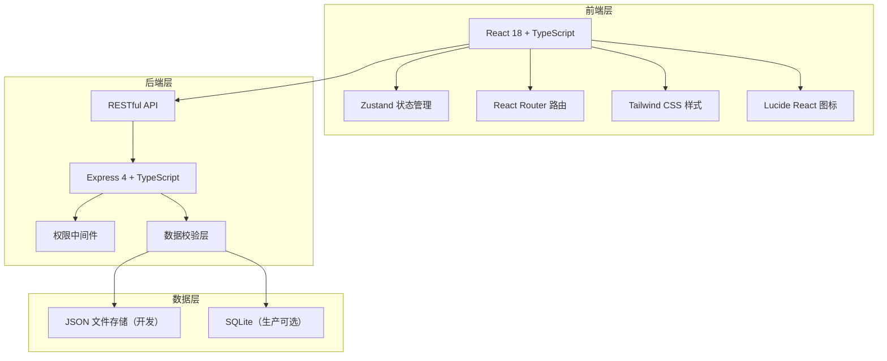
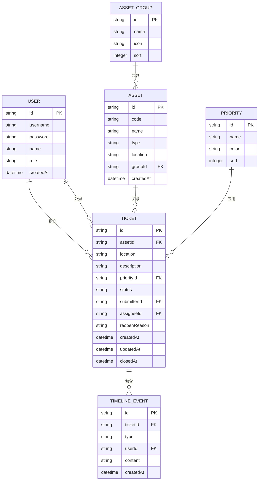

## 1. 架构设计



## 2. 技术说明

- **前端**：React@18 + TypeScript + Vite
- **样式**：TailwindCSS@3
- **状态管理**：Zustand
- **路由**：React Router DOM@6
- **图标**：Lucide React
- **后端**：Express@4 + TypeScript
- **初始化工具**：vite-init
- **数据存储**：JSON 文件持久化（确保重启后数据一致）

## 3. 路由定义

| 路由 | 用途 | 权限 |
|-------|---------|------|
| / | 看板首页 | 所有登录用户 |
| /tickets | 工单列表 | 所有登录用户 |
| /tickets/:id | 工单详情 | 所有登录用户 |
| /submit | 提交报修 | 读者/馆员/管理员 |
| /config/priorities | 优先级配置 | 管理员 |
| /config/assets | 资产分组管理 | 管理员 |
| /export | 导出中心 | 管理员 |
| /login | 登录页 | 公开 |

## 4. API 定义

### 4.1 认证接口

```typescript
// POST /api/auth/login
interface LoginRequest {
  username: string;
  password: string;
}
interface LoginResponse {
  token: string;
  user: User;
}

// GET /api/auth/me
interface AuthMeResponse {
  user: User;
}
```

### 4.2 工单接口

```typescript
// GET /api/tickets - 获取工单列表
interface TicketListQuery {
  assetId?: string;
  location?: string;
  priority?: string;
  assigneeId?: string;
  status?: TicketStatus;
  page?: number;
  pageSize?: number;
}
interface TicketListResponse {
  tickets: Ticket[];
  total: number;
}

// GET /api/tickets/:id - 获取工单详情
interface TicketDetailResponse {
  ticket: Ticket;
  timeline: TimelineEvent[];
}

// POST /api/tickets - 创建工单
interface CreateTicketRequest {
  assetId: string;
  location: string;
  description: string;
  priority: string;
  photos?: string[];
}
interface CreateTicketResponse {
  ticket: Ticket;
}

// PUT /api/tickets/:id/status - 更新工单状态
interface UpdateTicketStatusRequest {
  status: TicketStatus;
  assigneeId?: string;
  note?: string;
  reopenReason?: string;
}
interface UpdateTicketStatusResponse {
  ticket: Ticket;
}

// POST /api/tickets/:id/assign - 派工
interface AssignTicketRequest {
  assigneeId: string;
  note?: string;
}
```

### 4.3 资产接口

```typescript
// GET /api/assets
interface AssetListResponse {
  assets: Asset[];
  groups: AssetGroup[];
}

// POST /api/assets
interface CreateAssetRequest {
  code: string;
  name: string;
  type: string;
  location: string;
  groupId: string;
}
```

### 4.4 优先级配置接口

```typescript
// GET /api/priorities
interface PriorityListResponse {
  priorities: Priority[];
}

// PUT /api/priorities
interface UpdatePrioritiesRequest {
  priorities: Priority[];
}
```

### 4.5 导出接口

```typescript
// GET /api/export/tickets
interface ExportQuery {
  startDate?: string;
  endDate?: string;
  status?: string;
  format: 'csv' | 'json';
}
// Response: 文件下载
```

## 5. 数据模型

### 5.1 ER图



### 5.2 类型定义

```typescript
type UserRole = 'reader' | 'technician' | 'admin';
type TicketStatus = 'pending' | 'processing' | 'waiting_parts' | 'paused' | 'completed' | 'reopened';

interface User {
  id: string;
  username: string;
  name: string;
  role: UserRole;
}

interface AssetGroup {
  id: string;
  name: string;
  icon: string;
  sort: number;
}

interface Asset {
  id: string;
  code: string;
  name: string;
  type: string;
  location: string;
  groupId: string;
}

interface Priority {
  id: string;
  name: string;
  color: string;
  sort: number;
}

interface Ticket {
  id: string;
  assetId: string;
  asset?: Asset;
  location: string;
  description: string;
  priorityId: string;
  priority?: Priority;
  status: TicketStatus;
  submitterId: string;
  submitter?: User;
  assigneeId?: string;
  assignee?: User;
  reopenReason?: string;
  createdAt: string;
  updatedAt: string;
  closedAt?: string;
}

type TimelineEventType = 'created' | 'assigned' | 'status_changed' | 'note_added' | 'reopened';

interface TimelineEvent {
  id: string;
  ticketId: string;
  type: TimelineEventType;
  userId: string;
  user?: User;
  content: string;
  createdAt: string;
}
```

## 6. 项目目录结构

```
├── api/                          # 后端代码
│   ├── src/
│   │   ├── index.ts              # Express 入口
│   │   ├── routes/               # 路由定义
│   │   │   ├── auth.ts
│   │   │   ├── tickets.ts
│   │   │   ├── assets.ts
│   │   │   ├── priorities.ts
│   │   │   └── export.ts
│   │   ├── middleware/           # 中间件
│   │   │   ├── auth.ts
│   │   │   └── validation.ts
│   │   ├── data/                 # 数据存储
│   │   │   ├── db.json           # JSON 数据库
│   │   │   └── store.ts          # 数据访问层
│   │   ├── types/                # 类型定义
│   │   │   └── index.ts
│   │   └── utils/                # 工具函数
│   │       └── helpers.ts
│   └── package.json
├── src/                          # 前端代码
│   ├── components/               # 组件
│   │   ├── common/               # 通用组件
│   │   ├── layout/               # 布局组件
│   │   ├── ticket/               # 工单相关组件
│   │   └── config/               # 配置相关组件
│   ├── pages/                    # 页面
│   │   ├── Dashboard.tsx
│   │   ├── TicketList.tsx
│   │   ├── TicketDetail.tsx
│   │   ├── SubmitTicket.tsx
│   │   ├── ConfigPriorities.tsx
│   │   ├── ConfigAssets.tsx
│   │   ├── ExportCenter.tsx
│   │   └── Login.tsx
│   ├── store/                    # Zustand 状态
│   │   ├── authStore.ts
│   │   ├── ticketStore.ts
│   │   └── configStore.ts
│   ├── hooks/                    # 自定义 hooks
│   ├── utils/                    # 工具函数
│   ├── types/                    # 类型定义
│   ├── App.tsx
│   ├── main.tsx
│   └── index.css
├── shared/                       # 共享类型
│   └── types.ts
├── package.json
├── tsconfig.json
├── vite.config.ts
└── tailwind.config.js
```
